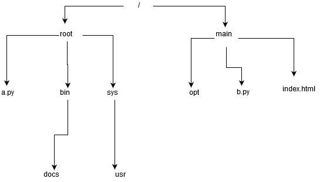

# DirStruct
 Implement a directory structure for a Linux Based operang System. You are not suppose to create actual files or directories. You should only give the implementaon of the Directory Structure like how would a directory Structure look if I create a Directory. I will give you the output in detail. You can assume that there exist no Directory Structure in the beginning
 
 Following tasks are implemented by the python scripts in the repositry.
### Implementation
The above program can will work on compiling **main.py**. On running main.py it enters an infinite loop to which the following commands can be given.
 
 ### Please note that the main directory starts as '/'. Enter path as '/' while creating root directory 
 ## 1. Create a Directory 
		a. Input – Absolute Path String – Example create_directory(“/home/prathiba/mydirectory/”)
		b. Output – Tuple or Pair (string,bool) indicang (path,True) or (“No such file or Directory”, False)
#### command = create_directory("path")
					 First repositry should be created under '/'
					 Example Input = create_repositry("/")
## 2. Create a File within a Directory 
		a. Input – Absolute Path String – Example create_file(“/home/prathiba/mydirectory/”) 
		b. Output – Tuple or Pair (string,bool) indicang (path,True) or (“No such file or Directory”, False)
		c. Note that if you are trying to create a file within a file, it should throw an excepon 
#### command = create_file("path")
			 Example Input = create_file("/root/bin/")
			
## 3. List at a parcular path
		a. Input – Absolute Path String – Example list(“/home/prathiba/mydirectory/”)
		b. Output – Key value pair (Type:list(string)) indicang the files and directories in that path
#### command = list("path")
			Example Input= list("/root/")
			
## 4. Check if a file/directory exists in the directory structure. 
		a. Input – String – Example check_existence(“mydirectory”).
		b. Output – True/False 
#### command = check_existence("file or directory name")
				Example Input = check_existence("bin")
## 5. Search a file or a directory in the enre structure starng from that path.
		a. Input - String - Example search("path", "searchstring"). search("/", "ssh")
		b. Output - Print all the paths which ends with the searchstring
		/run/user/1000/keyring/ssh
#### command = search("path","file_name or directory_name")
				Example Input = search("/","bin")

# DataStructures and Algorithms
A tree has been selected as a suiltable data structure with **parent node** containing reference of **child node** but child node doesn't have link to parent node.
Tree resembles the Linux Directory system.

 ### Sample commands to create above shown tree
 Enter command: **create_directory("/")**   
Enter the name of new Directory **root**  
Succesfully created  root  at /  
Enter command:**create_directory("/")**  
Enter the name of new Directory **main**  
Succesfully created  main  at /  
Enter command:**create_file("/root/")**  
Enter file name: **a.py**  
Created file  a.py  at  /root/  
Enter command:**create_directory("/root/")**  
Enter the name of new Directory **bin**  
Succesfully created  bin  at  /root/  
Enter command:**create_directory("/root/")**  
Enter the name of new Directory **sys**  
Succesfully created  sys  at  /root/  
Enter command:**create_directory("/root/bin/")**  
Enter the name of new Directory **docs**  
Succesfully created  docs  at  /root/bin/  
Enter command:**create_directory("/root/sys/")**  
Enter the name of new Directory **usr**  
Succesfully created  usr  at  /root/sys/  
Enter command:**create_directory("/main/")**  
Enter the name of new Directory **opt**  
Succesfully created  opt  at  /main/  
Enter command:**create_file("/main/")**  
Enter file name: **b.py**  
Created file  b.py  at  /main/  
Enter command:**create_file("/main/")**  
Enter file name: **index.html**  
Created file  index.html  at  /main/  
 
### Time analysis of algorithms
The implemented algorithms takes linear time for tree-traversal for given node and path. O(n) is time complexity of tree-traversal, where n is number of nodes in tree.
Since Insertion of a node to a tree is a contstant time task once it is in desired node, O(n) is also the complexity of Insertion.
Searching and checking existence is implemented as Recursive function whose time complexity remains as O(n)
